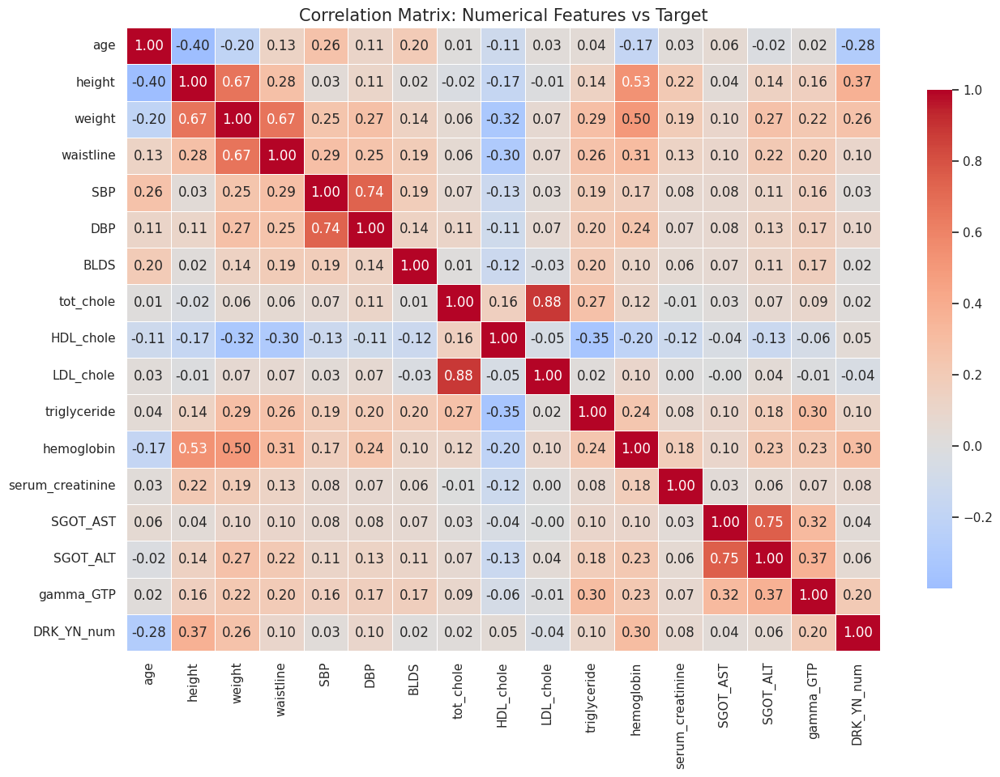
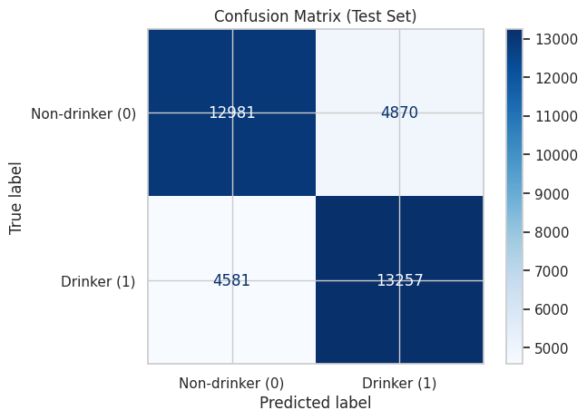
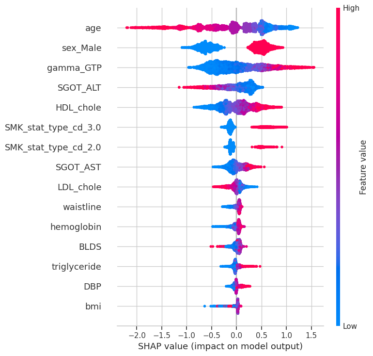

# Machine-Learning-Project
Machine learning analysis of health and lifestyle indicators to predict alcohol consumption behavior using physiological and demographic data.

## Project Overview
Alcohol consumption is a relevant public health concern, associated with cardiovascular diseases, liver disorders, and behavioral health risks. Understanding the factors associated with alcohol consumption can support preventive healthcare strategies and improve early identification of at-risk individuals. This project applies machine learning techniques to a large health examination dataset to predict alcohol consumption behavior.

The analysis explores two main questions:
- Predictive Modeling: Can demographic, lifestyle, and physiological indicators be used to accurately predict alcohol consumption?
- Feature Importance: Which health and behavioral variables contribute most to the prediction of drinking behavior?

## Dataset
The analysis uses the **Smoking and Drinking Dataset with Body Signal**, collected by the Korean National Health Insurance Service and publicly available on Kaggle.
Dataset source: https://www.kaggle.com/datasets/sooyoungher/smoking-drinking-dataset

The dataset contains health examination records of adult individuals and includes demographic, physiological, and lifestyle variables.

### Dataset Characteristics
- **178,441 observations**
- **24 features**
- mixed numerical and categorical variables

### Example Variables
Health indicators:
- systolic blood pressure
- diastolic blood pressure
- cholesterol levels
- triglycerides
- hemoglobin
- liver enzymes (AST, ALT, GGT)

Lifestyle indicators:
- smoking status
- body measurements
- demographic characteristics

### Target Variable
`DRK_YN`

Binary variable representing alcohol consumption:
- **1 → Drinker**
- **0 → Non-drinker**
The dataset is nearly perfectly balanced, allowing accuracy to be used as a reliable evaluation metric.

## Methods
### Machine Learning Modeling
The prediction task is formulated as a **binary classification problem**. Several machine learning algorithms were evaluated and compared in terms of predictive performance.

The analytical Workflow includes:
1. **Exploratory Data Analysis**: Examination of dataset structure, variable distributions, and correlations between physiological indicators.
2. **Missing Data Simulation**: Artificial introduction of missing values to simulate realistic data conditions.
3. **Data Preprocessing**: Feature scaling, categorical encoding, and handling of missing values.
4. **Model Training**: Training and comparison of machine learning classification models.
5. **Model Evaluation**: Performance assessment using accuracy, precision, recall, and confusion matrix.
6. **Model Interpretation**: Feature importance analysis using SHAP explainability techniques.

### Explainable AI
To interpret the model predictions, **SHAP (SHapley Additive Explanations)** was used.

SHAP provides insight into how individual features contribute to model predictions, enabling both global and local interpretability. This is particularly important in **health-related applications**, where understanding model decisions is essential.

## Results and Insights
The analysis highlights several important patterns.

Machine learning models are able to effectively predict alcohol consumption behavior using physiological and lifestyle indicators.
Certain biological markers, particularly liver enzyme levels and metabolic indicators, show strong predictive importance.

The correlation heatmap below highlights relationships between physiological variables in the dataset.

The confusion matrix illustrates the predictive performance of the final classification model.

SHAP explainability analysis reveals which variables contribute most strongly to model predictions.

These results demonstrate the potential of machine learning techniques for identifying behavioral patterns in large-scale health datasets.

## Tech Stack
Language: Python

Libraries:
- pandas
- numpy
- scikit-learn
- matplotlib
- seaborn
- SHAP
- XGBoost

Methods:
- supervised machine learning
- classification models
- feature importance analysis
- explainable AI

## Project Materials

Additional materials for this project are available below.
- **Project Notebook**: Full machine learning pipeline and analysis.
[Open the notebook](Alcohol_consumption_Marrali(1).ipynb)

## Author
Irene Marrali

BSc in Artificial Intelligence @ Università degli Studi di Milano, Università degli Studi di Pavia, Università degli Studi di Milano-Bicocca
